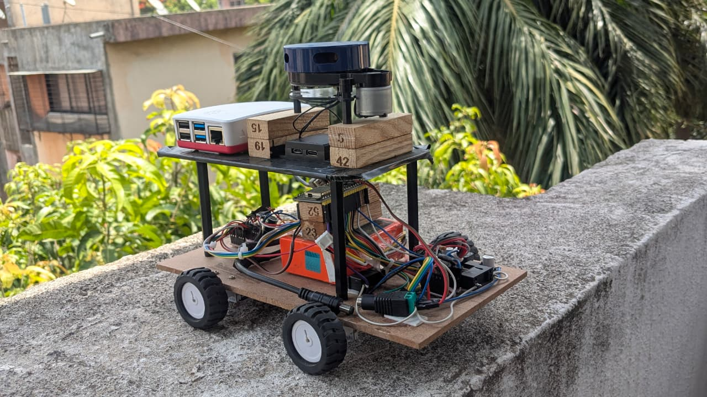
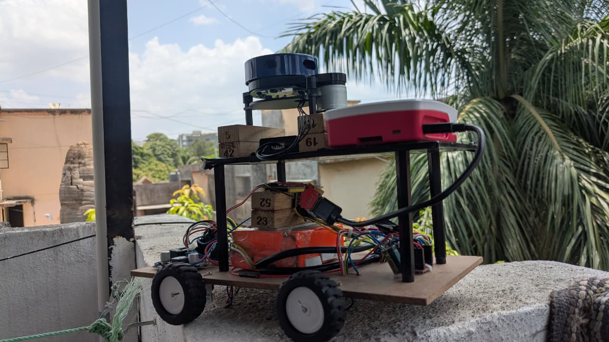
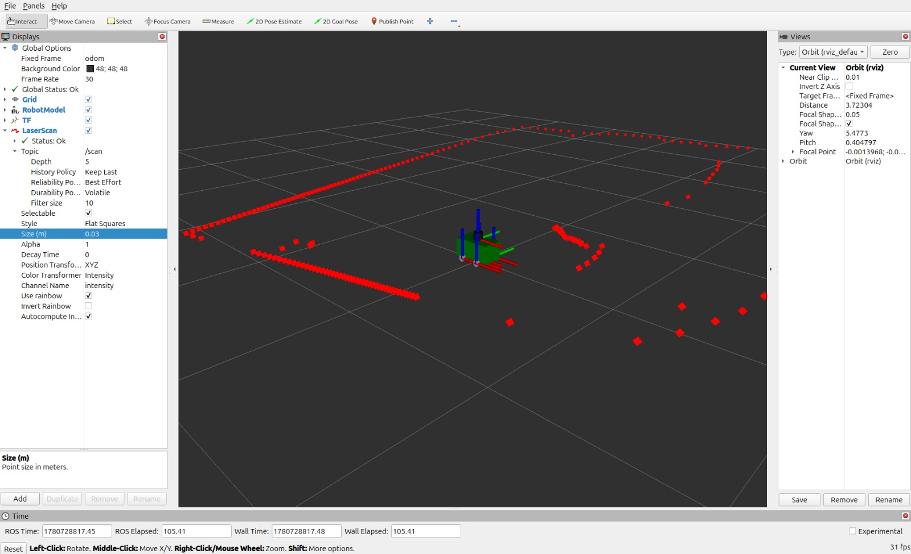

# 🤖 Transcend — ROS2 Autonomous Routine-Enforcing Rover

> **⚠️ Active Development — Phase 5 complete, Phase 6 (hardware integration) in progress.**
> This repository is a living project. Phases are pushed as milestones are completed.
> See [`Docs/PHASES.md`](Docs/PHASES.md) for the full roadmap.

A 4WD autonomous rover built to **help people who want to help themselves** — enforcing daily schedules, detecting doom-scrolling, and physically driving to the user as a real-world interruption cue.

Built on **ROS2 Jazzy**, **Raspberry Pi 4B**, **ESP32**, and **YDLidar X2** — every layer from the physical chassis to the ROS2 control stack was designed and built from scratch.

---

## 📹 Demo Video

[](YOUR_YOUTUBE_LINK_HERE)

---

## 📸 Project Photos

> Add your photos to the `Images/` folder and update paths below.

| Rover Build | Hardware Mount |
|:-----------:|:--------------:|
|  |  |

| RViz2 Visualisation |
|:-------------------:|
|  |

---

## 💡 What is Transcend?

Most productivity tools are passive — you dismiss the notification in 2 seconds. Transcend is **physical**. When you're doom-scrolling past your scheduled work time, it drives to you. You can't swipe it away.

The rover enforces routines by:
- Monitoring your schedule and detecting when you're off-track
- Detecting excessive phone screen time
- **Driving to your location** and providing a physical interruption cue
- Assisting with sleep and wake-up routines
- Doing none of this for people who don't want it — **opt-in by design**

Phases 1–5 establish the verified motion and simulation foundation. Phase 6 is integrating everything on real hardware. Phase 7 brings the behaviour intelligence.

---

## 📊 Project Status

| Phase | Description | Status |
|-------|-------------|--------|
| 1 | Hardware build — 4WD chassis, N20 encoders, filter circuit, custom mount | ✅ Complete |
| 2 | ROS2 workspace + URDF robot description | ✅ Complete |
| 3 | ros2_control hardware interface plugin (C++, RT-safe) | ✅ Complete |
| 4 | Bringup launch + YDLidar + micro-ROS bridge | ✅ Complete |
| 5 | Gazebo Harmonic simulation | ✅ Complete |
| 6 | Real hardware integration — Pi 4B + ESP32 + LiDAR running together | 🔄 In Progress |
| 7 | SLAM Toolbox + Nav2 autonomous navigation | 🔲 Planned |
| 8 | Transcend behaviour layer — schedule enforcement, doom-scroll detection | 🔲 Planned |
| 9 | AI/ML integration — person tracking, computer vision | 🔲 Planned |
| 10 | Full system integration + mobile companion app | 🔲 Planned |

---

## ✨ What's Working Right Now

- ✅ Real rover drives in **98% straight line** under PID wheel speed control
- ✅ `diff_drive_controller` receives `/cmd_vel` → splits to 4 independent wheel targets
- ✅ Encoder feedback published back to ROS2 via `/wheel_vel_state`
- ✅ Full URDF with real physical dimensions (measured from actual rover)
- ✅ **Gazebo Harmonic simulation fully working** — differential drive, joint states, LiDAR
- ✅ YDLidar X2 scan publishing on `/scan` topic
- ✅ RViz2 visualising robot model and LiDAR scan in real time
- ✅ Single launch file brings up the entire ROS2 stack on Raspberry Pi
- 🔄 Full hardware stack integration currently in progress

---

## 🛠️ Tech Stack

### Software

| Tool | Role |
|------|------|
| **ROS2 Jazzy** | Robot middleware — nodes, topics, services, actions |
| **ros2_control** | Real-time hardware abstraction layer |
| **diff_drive_controller** | Differential drive kinematics + velocity control |
| **Gazebo Harmonic** | Physics simulation ✅ working |
| **RViz2** | Sensor and robot model visualisation |
| **micro-ROS** | ROS2 on embedded ESP32 (UDP transport) |
| **SLAM Toolbox** | Simultaneous localisation and mapping *(Phase 7)* |
| **Nav2** | Autonomous navigation stack *(Phase 7)* |

### Languages

| Language | Used For |
|----------|---------|
| **C++** | ros2_control hardware interface plugin |
| **Python** | ROS2 utility nodes, behaviour layer *(Phase 8)* |
| **XML / xacro** | URDF robot description, launch files |
| **YAML** | Controller config, sensor parameters |
| **Arduino C++** | ESP32 PID firmware + WiFi web interface |

### Hardware

| Component | Details |
|-----------|---------|
| **Raspberry Pi 4B** | Main compute — runs full ROS2 Jazzy stack |
| **ESP32** | Motor controller — PID + micro-ROS UDP bridge |
| N20 Encoder Motors ×4 | Geared DC motors with quadrature encoders |
| TB6612FNG H-Bridge ×2 | Motor driver ICs |
| YDLidar X2 | 360° 2D LiDAR — 8m range, 10Hz |
| Camera Module | Visual input *(Phase 9)* |
| Custom Hardware Mount | Built from scratch — camera, LiDAR, and Pi all mounted |
| Filter Circuit | RC filter + power management for 5V/3.3V rails |
| Li-Po Battery | Main power supply |

---

## 🏗️ Architecture

```
┌──────────────────────────────────────────────────────────────────┐
│                   Raspberry Pi 4B (ROS2 Jazzy)                   │
│                                                                  │
│  /cmd_vel (Twist)                                                │
│       ↓                                                          │
│  diff_drive_controller ─────────────── /joint_states            │
│       ↓  (wheel velocity targets)            ↑                  │
│  TranscendHardwareInterface      joint_state_broadcaster        │
│       ↓  /wheel_vel_cmd               ↑  /wheel_vel_state       │
│  micro_ros_agent (UDP:8888)           │                         │
│                                       │                         │
│  YDLidar X2 ──────────→ /scan         │                         │
│  robot_state_publisher ──→ /tf        │                         │
└──────────────────┬────────────────────┼─────────────────────────┘
                   │ UDP               │ UDP
┌──────────────────▼────────────────────┴─────────────────────────┐
│                      ESP32 (micro-ROS)                           │
│                                                                  │
│  Subscribes: /wheel_vel_cmd  → PID setpoints per wheel           │
│  Publishes:  /wheel_vel_state ← encoder feedback per wheel       │
│                                                                  │
│  Independent PID loop per wheel (20Hz)                           │
│  TB6612FNG H-bridge driver ×2                                    │
│  N20 encoder motors ×4                                           │
└──────────────────────────────────────────────────────────────────┘
```

---

## 📦 ROS2 Packages

### `transcend_description`
URDF/xacro robot model built from real measured rover dimensions.

| File | Description |
|------|-------------|
| `rover.urdf.xacro` | Top-level robot file |
| `mobile_base.xacro` | Full geometry — links, joints, inertia, ros2_control block |
| `common_properties.xacro` | Reusable inertia macros (box, cylinder, sphere) |
| `rover_gaz.xacro` | Gazebo Harmonic plugins (diff drive + joint state publisher) |
| `ros2_control_snippet.xacro` | ros2_control hardware block |

**Real measured dimensions:**

| Parameter | Value |
|-----------|-------|
| Base length | 0.25 m |
| Base width | 0.14 m |
| Base height | 0.125 m |
| Wheel radius | 0.022 m |
| Wheel separation | 0.158 m |

---

### `transcend_hardware`
Custom `ros2_control` `SystemInterface` plugin — the bridge between ROS2 and ESP32.

**Key design decisions:**
- `write()` is on the **RT thread** — it only deposits velocity commands into `pending_cmd_` behind a mutex and sets an atomic flag. It never blocks.
- A **single background thread** handles both DDS subscriber callbacks (receiving `/wheel_vel_state`) and publisher calls (sending `/wheel_vel_cmd`). Network I/O never touches the RT thread.
- This avoids the common anti-pattern of calling `publish()` directly from `write()`, which causes RT jitter.

| File | Description |
|------|-------------|
| `include/transcend_hardware_interface.hpp` | Class declaration — 4-joint SystemInterface |
| `src/transcend_hardware_interface.cpp` | Full RT-safe implementation |
| `WheelVelocity.msg` | Custom message: fl fr rl rr float32 fields |
| `transcend_hardware_plugin.xml` | pluginlib export |

---

### `transcend_bringup`
Single launch file that starts the entire rover stack.

| File | Description |
|------|-------------|
| `launch/rover_pi.launch.xml` | Starts everything — RSP, controller manager, LiDAR, micro-ROS agent |
| `config/transcend_controllers.yaml` | diff_drive_controller gains + limits |
| `config/ydlidar_x4.yaml` | YDLidar X2 sensor parameters |
| `config/gazebo_bridge.yaml` | ROS ↔ Gazebo topic bridge |
| `config/transcend_config.rviz` | Saved RViz2 configuration |

---

### `ESP32_Firmware` (this repo)
Arduino firmware running on the ESP32 motor controller.

| Feature | Details |
|---------|---------|
| PID control | Independent per wheel, 20Hz update rate |
| WiFi web interface | D-pad controller served from ESP32 flash |
| Live telemetry | Target speed, actual speed, PWM per motor in browser |
| Live PID tuning | Adjust Kp/Ki/Kd from browser without re-flashing |
| OTA updates | Re-flash wirelessly after first USB upload |
| Encoder calibration | Serial command `M` measures MAX_SPEED_TICKS automatically |

> ⚠️ **Before uploading:** fill in `YOUR_WIFI_SSID`, `YOUR_WIFI_PASSWORD`, and `YOUR_OTA_PASSWORD` at the top of the `.ino` file.

---

## ⚙️ Setup & Installation

### Prerequisites

| Requirement | Version |
|-------------|---------|
| Ubuntu | 24.04 LTS |
| ROS2 | Jazzy Jalisco |
| Gazebo | Harmonic |
| ESP32 Arduino Core | 3.x |

### 1. Clone the Repository

```bash
git clone https://github.com/YOUR_USERNAME/Transcend-Rover.git
cd Transcend-Rover
```

### 2. Install ROS2 Dependencies

```bash
sudo apt update
rosdep update
rosdep install --from-paths src --ignore-src -r -y
```

### 3. Install Additional Packages

```bash
# ros2_control stack
sudo apt install ros-jazzy-ros2-control ros-jazzy-ros2-controllers

# diff_drive_controller + joint_state_broadcaster
sudo apt install ros-jazzy-diff-drive-controller ros-jazzy-joint-state-broadcaster

# micro-ROS agent
sudo apt install ros-jazzy-micro-ros-agent

# Gazebo Harmonic + ROS bridge
sudo apt install ros-jazzy-ros-gz-sim ros-jazzy-ros-gz-bridge

# YDLidar ROS2 driver
cd src && git clone https://github.com/YDLIDAR/ydlidar_ros2_driver.git && cd ..
```

### 4. Build

```bash
source /opt/ros/jazzy/setup.bash
colcon build --symlink-install
source install/setup.bash
```

### 5. Launch on Real Rover (Raspberry Pi 4B)

```bash
source install/setup.bash
ros2 launch transcend_bringup rover_pi.launch.xml
```

### 6. Teleoperate

```bash
ros2 run teleop_twist_keyboard teleop_twist_keyboard
```

### 7. Visualise in RViz2

```bash
rviz2 -d src/transcend_bringup/config/transcend_config.rviz
```

### 8. ESP32 Firmware Upload

1. Open `ESP32_Firmware/transcend_esp32_pid/transcend_esp32_pid.ino` in Arduino IDE
2. Fill in your WiFi credentials at the top
3. Select board: **ESP32 Dev Module** and your COM port
4. Upload via USB (first time only — OTA after that)
5. Open Serial Monitor at **115200 baud** to see the IP address
6. Navigate to `http://[IP]` on any device on the same WiFi

---

## 🔑 Key Topics at Runtime

| Topic | Type | Description |
|-------|------|-------------|
| `/cmd_vel` | `Twist` | Drive commands into diff_drive_controller |
| `/wheel_vel_cmd` | `Float32MultiArray` | Per-wheel velocity targets → ESP32 |
| `/wheel_vel_state` | `Float32MultiArray` | Per-wheel actual velocity ← ESP32 |
| `/joint_states` | `JointState` | All 4 wheel positions + velocities |
| `/odom` | `Odometry` | Wheel odometry from diff_drive_controller |
| `/scan` | `LaserScan` | 360° LiDAR scan from YDLidar X2 |
| `/tf` | `TFMessage` | odom → base_footprint → base_link transform tree |

---

## 📁 Repository Structure

```
Transcend-Rover/
│
├── README.md
├── LICENSE                          ← Apache 2.0
├── .gitignore                       ← excludes build/, install/, log/
├── CONTRIBUTING.md
├── .github/
│   └── ISSUE_TEMPLATE/
│
├── src/
│   ├── transcend_description/       ← URDF/xacro robot model
│   │   ├── urdf/
│   │   │   ├── rover.urdf.xacro
│   │   │   ├── mobile_base.xacro
│   │   │   ├── common_properties.xacro
│   │   │   ├── rover_gaz.xacro
│   │   │   └── ros2_control_snippet.xacro
│   │   └── meshes/
│   │
│   ├── transcend_hardware/          ← C++ ros2_control plugin (RT-safe)
│   │   ├── include/transcend_hardware_interface.hpp
│   │   ├── src/transcend_hardware_interface.cpp
│   │   └── WheelVelocity.msg
│   │
│   └── transcend_bringup/           ← Launch files + all config
│       ├── launch/rover_pi.launch.xml
│       └── config/
│           ├── transcend_controllers.yaml
│           ├── ydlidar_x4.yaml
│           ├── gazebo_bridge.yaml
│           └── transcend_config.rviz
│
├── ESP32_Firmware/
│   └── transcend_esp32_pid/
│       └── transcend_esp32_pid.ino  ← ESP32 PID + WiFi + OTA firmware
│
├── Images/                          ← Add rover photos + screenshots
│
└── Docs/
    └── PHASES.md                    ← 10-phase development tracker
```

---

## 📚 Learning Outcomes (So Far)

- ROS2 node, topic, service, and action architecture
- Writing a custom `ros2_control` `SystemInterface` plugin in C++
- RT-safe threading — separating real-time and DDS I/O layers
- URDF/xacro modelling with calculated inertia tensors
- Differential drive kinematics — `wheel_separation` and `wheel_radius` tuning
- micro-ROS UDP transport — ESP32 as a first-class ROS2 node
- Gazebo Harmonic simulation with ROS2 bridge
- RViz2 visualisation configuration
- Ubuntu system administration and workspace management
- colcon build system and ament_cmake package structure
- PID controller implementation with anti-windup (ESP32)
- WiFi HTTP server and OTA firmware updates (ESP32)

---

## 🚀 Roadmap

See [`Docs/PHASES.md`](Docs/PHASES.md) for the full detailed phase breakdown.

**Current focus:** Getting the full hardware stack (Pi 4B + ESP32 + LiDAR) running reliably together on the real rover before moving to SLAM and Nav2.

---

## 👤 Author

**Mayank Jain**
Robotics and Automation Engineer

> *ROS2 architecture, hardware interface plugin, URDF modelling, Gazebo simulation, ESP32 firmware, physical hardware build — all designed and built from scratch.*

[](https://github.com/MayankJain-22)

---

## 📄 License

Apache 2.0 — see [LICENSE](LICENSE)
